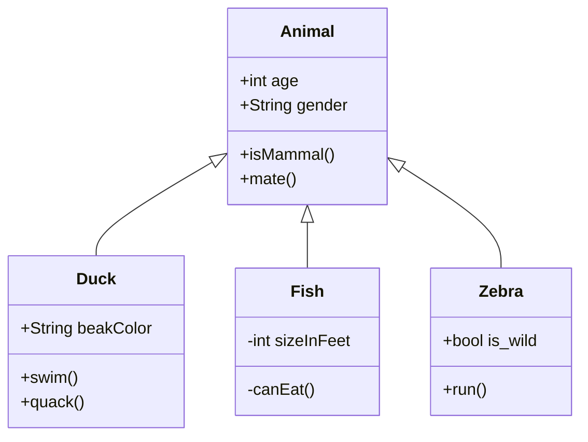

# Utb.PizzaKiosk

Pizzeria Self-Service Kiosk - Student project for AP3AF and AK3AF courses.

## Learning Objectives

### Audience

The audience is the students who have studied basic programming and OOP courses. Students are not expected to have experience with software projects.

### Goal

We want the students to apply their knowledge and comprehension of course topics on the semestral project so that students can use this project as a template for their own applications. 

### Learning outcomes

#### Knowledge

-	The **student** lists client-side frameworks.
-	The **student** lists backend frameworks.

#### Comprehension

-	The **student** explains the Model-View-ViewModel design pattern for creating a user interface.
-	The **student** explains the concepts of object serialization and deserialization.
-	The **student** explains how to access a relational database in code.
-	The **student** explains the concept of object-relational mapping (ORM).
-	The **student** explains how to call a web API on a client application.
-	The **student** justifies the benefits of separating the code for creating the user interface from the actual application logic.

#### Application

-	The **student** applies the Model-View-ViewModel design pattern to the user interface design.
-	The **student** defines the user interface independently of the application logic.
-	The **student** serializes and deserializes objects.
-	The **student** accesses relational database in code.
-	The **student** uses an object-relational mapping (ORM) library.
-	The **student** calls a web API on a client application.

## Software Requirements

### Glossary

- A **kiosk** is a hardware device with touch display that a customer uses for ordering a pizza.
- A **kiosk session** is a personalized ordering experience for a customer. 
- An **order fulfillment option** is a way in which the order is delivered and served to the customer.
- A **pizza** is a dish that is in the pizzeria menu.
- A **pizza’s option** is a choice for a pizza including toppings, crust types, sauces, and other customizable features.
- A **pizza's selection** is a list of unique options available for a specific kind of pizza.
- A **pizza’s configuration** is a list of chosen options by the customer for a specific kind of pizza.
- A **pizza menu** is a distinct, non-empty list of various types of pizza and their configurations.
- A **shopping cart** is a list of pizzas and their configurations chosen by the customer.
- An **order** is a non-empty list containing duplicate of pizzas and their configurations from the shopping cart, along with the current state of the order.

### Roles

- A **customer** is and individual or group that would like to order and configure pizzas and eat it in the restaurant or take it away. 
- An **operator** periodically checks for orders and process orders. 
- A **manager** creates, edits, and manages pizza menu, including names, descriptions, options, and configuration. 

### User Requirements

The customer

**Context: Kiosk Session:**

1. Customer arriving at the kiosk:
   - The **customer** wants to have the kiosk ready for them.
2. Initialing a new session:
   - The **customer** wants to specify the order fulfillment options and begin the new personalized kiosk session.

**Context: Pizza selection and configuration:**

- The **customer** wants to navigate through the menu easily to select their desired options.

- The **customer** wants to have the same menu during the kiosk session.
- The **customer** wants to select the desired pizza from the pizza menu.

**Context: Cart Interaction:**
- Then the **costumer** wants to add pizzas and their configurations to the cart.
- Or the **costumer** wants to delete pizzas and their configuration from the cart.
- The **customer** wants to delete pizza and its pizza’s configurations in the cart.
- The **customer** wants to order pizza and its pizza’s configurations in the cart.

**Context: Order Review**

- The **customer** wants to see the total order cost and receive a summary before placing the order. 

The operator

- The **operator** wants to see the list of non-empty multiset of orders ordered by date ascending.
- The **operator** wants to complete the order.
- The **operator** wants to cancel the order.

The manager

- The **manager** wants to create the pizza menu.
- Then the **manager** wants to edit pizza menu.

### Functional requirements

TODO: Rewrite user requlements to describe it for developer.

### Non-Functional requirements.

TODO: Decide where to put desktop application (maybe design). Check sentences in chatgpt.

- Usability: The user interface should be intuitive and easy to navigate.
- Localization: one language only, English or Czech.
- Accessibility: application should support or in near future supports individuals with disabilities, adhering to accessibility guidelines.
- Security: Access to operator and manager functionalities shall be secured through authentication and authorization.
- Compatibility: Client-side Multiplatform applications (Windows, Linux, Mac).
- Desktop application with touch support for a customer
- Desktop application with touch support for an operator.
- Desktop application for a manager.
- Source code: Easy and readable code, essential code only.
- Testing: The system shall support time simulation for testing purposes.

### Constraints

- Tests: Only one example of unit test to make project achievable in time.
- Payment: No payment implementation, just order confirmation to make project easier.
- Local database so that students do not need to setup server.
- Web API for the backend pre-implemented by a teacher.
- Latest standard .NET core

### Data Requirements

TODO: complete this.

- A kiosk session: state:  state: ready, inuse, , Dine-in, takeout
- The pizza: Name: PEPPERONI PIZZA, Description: tomato base shredded mozzarella

### Architecture and Design

TODO: Rewrite as complete sentences.

- Model-View-ViewModel (MVVM) design pattern for user interface.
- Software uses the Web API that access local database (Sqlite) using the Object-relational mapping (ORM).
- Separation of User Interface and Application Logic.
- Time simulation for testing.

#### Class diagrams

TODO: Create pizza kiosk classes.

---
## Acknowledgments 
- I would like to thank Luis Antonio Beltran for helping me with this project and for his deep knowledge that he has shared with me about MVVM and MAUI.
- While this assignment is the result of my (Erik Král) learning and creative effort, I acknowledge that the GPT-3.5 language model developed by OpenAI's guidance has deepened my understanding of topics related to software requirements, UML diagrams, and project management. I also appreciate that the GPT-3.5 model has assisted me in improving English grammar and sentence structuring.
