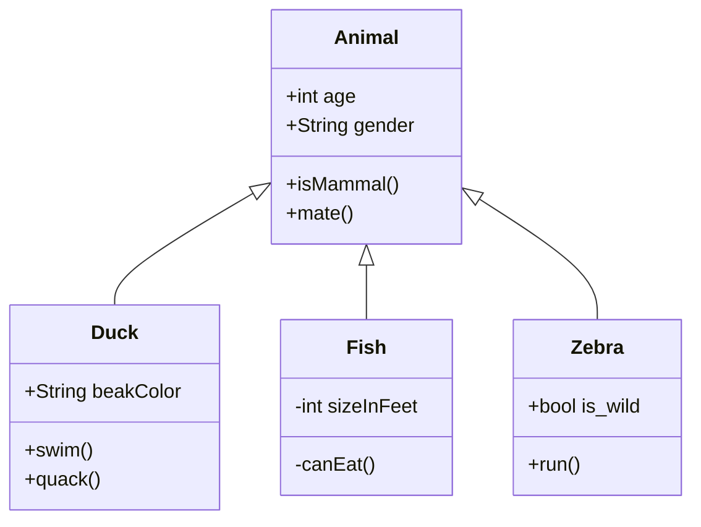

# Utb.PizzaKiosk
Pizzeria Self-Service Kiosk - Student project for AP3AF and AK3AF courses

---
## Acknowledgments 

While this assignment is the result of my learning and creative effort, I acknowledge that the GPT-3.5 language model developed by OpenAI's guidance has deepened my understanding of topics related to software requirements, UML diagrams, and project management. I am grateful for both the knowledge I've gained and my role in crafting this assignment.
