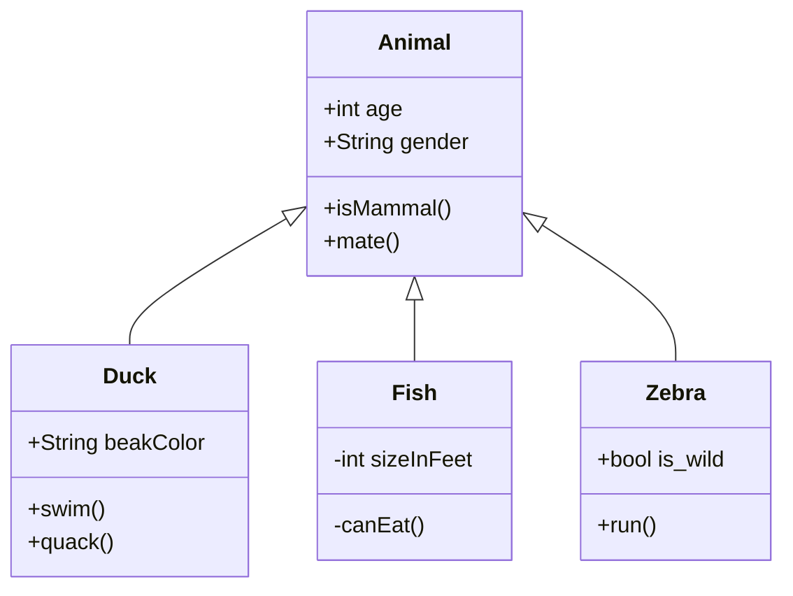

# Utb.PizzaKiosk

Pizzeria Self-Service Kiosk - Student project for AP3AF and AK3AF courses.

## Learning Objectives

### Audience

The audience is the students who have studied basic programming and OOP courses, but not all of them have successfully passed these subjects. They are not expected to have experience with software projects.

### Goal

We want the students to apply their knowledge and comprehension of course topics on the semestral project so that students can use this project as a template for their own applications. 

### Learning outcomes

#### Knowledge

-	The student lists client-side frameworks.
-	The student lists backend frameworks.

#### Comprehension

-	The student explains the Model-View-ViewModel design pattern for creating a user interface.
-	The student explains the concepts of object serialization and deserialization.
-	The student explains how to access a relational database in code.
-	The student explains the concept of object-relational mapping (ORM).
-	The student explains how to call a web API on a client application.
-	The student justifies the benefits of separating the code for creating the user interface from the actual application logic.

#### Application

-	The student applies the Model-View-ViewModel design pattern to the user interface design.
-	The student defines the user interface independently of the application logic.
-	The student serializes and deserializes objects.
-	The student accesses relational database in code.
-	The student uses an object-relational mapping (ORM) library.
-	The student calls a web API on a client application.

## Software Requirements

Glossary

- A **customer** is and individual or group that would like to customize and order a pizza
-	A **kiosk** is a hardware device with touch display for a new kiosk session for a customer.
-	A **kiosk session** is a personalized ordering experience. 
-	An **order fulfillment option** is a way in which the order is delivered and served.
-	A **pizza** is a dish that is in the pizzeria menu.
-	A **pizza's selection** is a list of unique options available for a specific kind of pizza.
-	A **pizza’s option** is a choice for a pizza including toppings, crust types, sauces, and other customizable features.
-	A **pizza’s configuration** is a list of options for a specific kind of pizza.
-	A **pizza menu** is a non-empty list of unique various types of pizza and their configurations.
-	A **shopping cart** is a list of pizzas and their configurations.
-	An **order** is a non-empty list containing duplicate of pizzas and their configurations from the shopping cart, and current state of the order.

---
## Acknowledgments 
- I would like to thank Luis Antonio Beltran for helping me with this project and for his deep knowledge that he has shared with me about MVVM and MAUI.
- While this assignment is the result of my (Erik Král) learning and creative effort, I acknowledge that the GPT-3.5 language model developed by OpenAI's guidance has deepened my understanding of topics related to software requirements, UML diagrams, and project management. I also appreciate that the GPT-3.5 model has assisted me in improving English grammar and sentence structuring.
