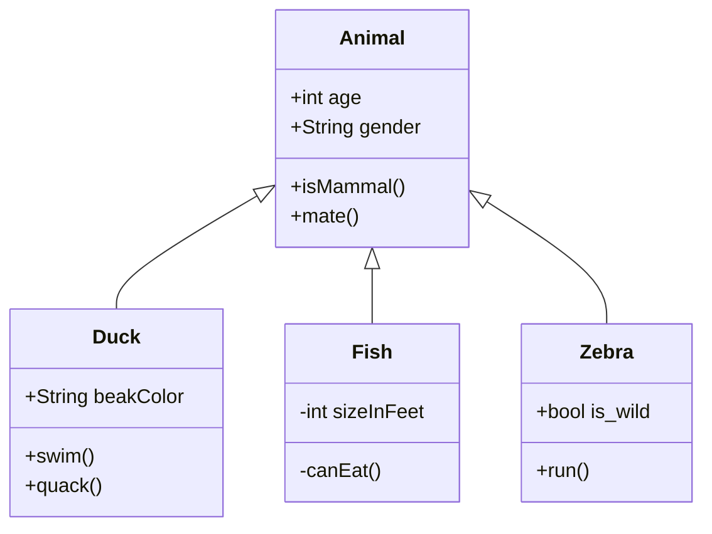

# Utb.PizzaKiosk

Pizzeria Self-Service Kiosk - Student project for AP3AF and AK3AF courses

## Learning Objectives

### Audience

The audience are the students who have studied basic programming and OOP courses, but not all of them have successfully passed these subjects. They have mostly no experience with software projects.

### Goal

We want the students to apply their knowledge and comprehension of course topics on the semestral project so that students can use this project as a template for their own applications. 

### Learning outcomes

#### Knowledge

•	The student lists client-side frameworks.
•	The student lists backend frameworks.

#### Comprehension

•	The student explains the Model-View-ViewModel design pattern for creating a user interface.
•	The student explains the concepts of object serialization and deserialization.
•	The student explains how to access a relational database in code.
•	The student explains the concept of object-relational mapping (ORM).
•	The student explains how to call a web API on a client application.
•	The student justifies the benefits of separating the code for creating the user interface from the actual application logic.

#### Application

•	The student applies the Model-View-ViewModel design pattern to the user interface design.
•	The student defines the user interface independently of the application logic.
•	The student serializes and deserializes objects.
•	The student accesses relational database in code.
•	The student uses an object-relational mapping (ORM) library.
•	The student calls a web API on a client application.

---
## Acknowledgments 

While this assignment is the result of my learning and creative effort, I acknowledge that the GPT-3.5 language model developed by OpenAI's guidance has deepened my understanding of topics related to software requirements, UML diagrams, and project management.
